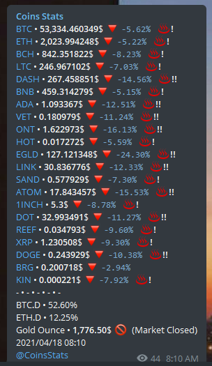

<!-- PROJECT SHIELDS -->
[![Forks][forks-shield]][forks-url]
[![Stargazers][stars-shield]][stars-url]
[![Issues][issues-shield]][issues-url]
[![MIT License][license-shield]][license-url]
[![LinkedIn][linkedin-shield]][linkedin-url]

<!-- PROJECT LOGO -->
<br />
<p align="center">
  <a href="https://github.com/ferisystem/CoinsStats">
    
  </a>

  <h1 align="center">Coins Stats</h3>

  <p align="center">
    Stats of 18 popular coins + BTC & ETH Dominance
    <br />
    <a href="https://github.com/ferisystem/CoinsStats"><strong>Explore the docs »</strong></a>
    <br />
    <br />
    <a href="https://github.com/ferisystem/CoinsStats">View Demo</a>
    ·
    <a href="https://github.com/ferisystem/CoinsStats/issues">Report Bug</a>
    ·
    <a href="https://github.com/ferisystem/CoinsStats/issues">Request Feature</a>
  </p>
</p>


<!-- TABLE OF CONTENTS -->
<details open="open">
  <summary><h2 style="display: inline-block">Table of Contents</h2></summary>
  <ol>
    <li>
      <a href="#about-the-project">About The Project</a>
      <ul>
        <li><a href="#built-with">Built With</a></li>
      </ul>
    </li>
    <li>
      <a href="#getting-started">Getting Started</a>
      <ul>
        <li><a href="#prerequisites">Prerequisites</a></li>
        <li><a href="#installation">Installation</a></li>
      </ul>
    </li>
    <li><a href="#roadmap">Roadmap</a></li>
    <li><a href="#contributing">Contributing</a></li>
    <li><a href="#license">License</a></li>
    <li><a href="#contact">Contact</a></li>
    <li><a href="#acknowledgements">Acknowledgements</a></li>
  </ol>
</details>

<!-- ABOUT THE PROJECT -->
## About The Project


[Channel CoinsStats for See how it is](https://t.me/CoinsStats)

An efficient [Telegram-bot](https://core.telegram.org/bots/api) for getting the statistics of famous **Crypto Currency** markets' coins and tokens in Telegram which can be installed easily

### Built With

This section should list any major frameworks that you built your project using. Leave any add-ons/plugins for the acknowledgements section. Here are a few examples.
* [Python](https://python.org) 3.6v
* [Telegram-Bot Api](https://core.telegram.org/bots/api)
* [Telethon Framework](https://github.com/LonamiWebs/Telethon)
* [datetime module](https://docs.python.org/3/library/datetime.html)
* [asyncio module](https://docs.python.org/3/library/asyncio.html)
* [requests module](https://requests.readthedocs.io/en/master)
* [Redis Database](https://github.com/andymccurdy/redis-pyr)
* [Coinstats app Api](https://coinstats.app)
* [CoinMarketCap Api](https://coinmarketcap.com/)


<!-- GETTING STARTED -->
## Getting Started

This is a help for installation.

<ul>

### Prerequisites

<ul>

* Ubuntu 16.04+ (I prefer 16.04)
* You have to installed Python3.6 because [Telethon](https://github.com/LonamiWebs/Telethon) need Python3.6. so follow helps on google for "install Python3.6 on ubuntu"
* Get a API Key at [coinmarketcap.com](https://coinmarketcap.com)
* Get API_HASH & API_ID at [my.telegram.org](https://my.telegram.org/)
* Get Bot_Token at [Botfather](https://telegram.me/botfather)
</ul>

### Installation

<ul>

1. Clone the repo
   ```sh
   git clone https://github.com/ferisystem/CoinsStats.git
   ```
2. Enter your Bot_Token in `config.py`
   ```PY
   BOT_TOKEN = 'ENTER BOT_TOKEN'
   ```
3. Enter your api_hash & api_id in `config.py`
   ```PY
   API_HASH = 'ENTER API_HASH'
   API_ID = 'ENTER API_ID'
   ```
4. Enter your Coinmarketcap API in `config.py`
   ```PY
   CMP_API_KEY = 'ENTER CoinMarketCap API'
   ```
5. Enter your Channel/SuperGroup/Group/Private Telegram ID in `config.py`
   ```PY
   DESTINATION_ID = 'ENTER DESTINATION_ID'
   ```
6. Enter your Private Telegram ID in `config.py` for receive Exceptions & Erros
   ```PY
   SUDO_ID = 'ENTER SUDO_ID'
   ```
7. Now you have to add this command in `crontab -e` on ubuntu terminal
   ```sh
   * * * * * python3.6 ./CoinsStats/bot.py
   ```

</ul>
</ul>


<!-- ROADMAP -->
## Roadmap

See the [open issues](https://github.com/othneildrew/Best-README-Template/issues) for a list of proposed features (and known issues).


<!-- CONTRIBUTING -->
## Contributing

Dear programmer, you can help me in this project. how? read this text.
Contributions are what make the open source community such an amazing place to be learn, inspire, and create. Any contributions you make are **greatly appreciated**.

1. Fork the Project
2. Create your Feature Branch (`git checkout -b feature/AmazingFeature`)
3. Commit your Changes (`git commit -m 'Add some AmazingFeature'`)
4. Push to the Branch (`git push origin feature/AmazingFeature`)
5. Open a Pull Request

<!-- LICENSE -->
## License

Distributed under the MIT License. See `LICENSE` for more information.


<!-- CONTACT -->
## Contact

Your Name - [@your_twitter](https://twitter.com/your_username) - email@example.com

Project Link: [https://github.com/your_username/repo_name](https://github.com/your_username/repo_name)


<!-- ACKNOWLEDGEMENTS -->
## Acknowledgements
* [GitHub Emoji Cheat Sheet](https://www.webpagefx.com/tools/emoji-cheat-sheet)
* [Img Shields](https://shields.io)
* [Choose an Open Source License](https://choosealicense.com)
* [GitHub Pages](https://pages.github.com)
* [Animate.css](https://daneden.github.io/animate.css)
* [Loaders.css](https://connoratherton.com/loaders)
* [Slick Carousel](https://kenwheeler.github.io/slick)
* [Smooth Scroll](https://github.com/cferdinandi/smooth-scroll)
* [Sticky Kit](http://leafo.net/sticky-kit)
* [JVectorMap](http://jvectormap.com)
* [Font Awesome](https://fontawesome.com)


<!-- MARKDOWN LINKS & IMAGES -->
[forks-shield]: https://img.shields.io/github/forks/ferisystem/CoinsStats.svg?style=for-the-badge
[forks-url]: https://github.com/ferisystem/CoinsStats/network/members
[stars-shield]: https://img.shields.io/github/stars/ferisystem/CoinsStats.svg?style=for-the-badge
[stars-url]: https://github.com/ferisystem/CoinsStats/stargazers
[issues-shield]: https://img.shields.io/github/issues/ferisystem/CoinsStats.svg?style=for-the-badge
[issues-url]: https://github.com/ferisystem/CoinsStats/issues
[license-shield]: https://img.shields.io/github/license/ferisystem/CoinsStats.svg?style=for-the-badge
[license-url]: https://github.com/ferisystem/CoinsStats/blob/main/LICENSE
[linkedin-shield]: https://img.shields.io/badge/-LinkedIn-black.svg?style=for-the-badge&logo=linkedin&colorB=555
[linkedin-url]: https://linkedin.com/in/alireza-fereidouni-852bb11b1
[product-screenshot]: img/screenshot.png
